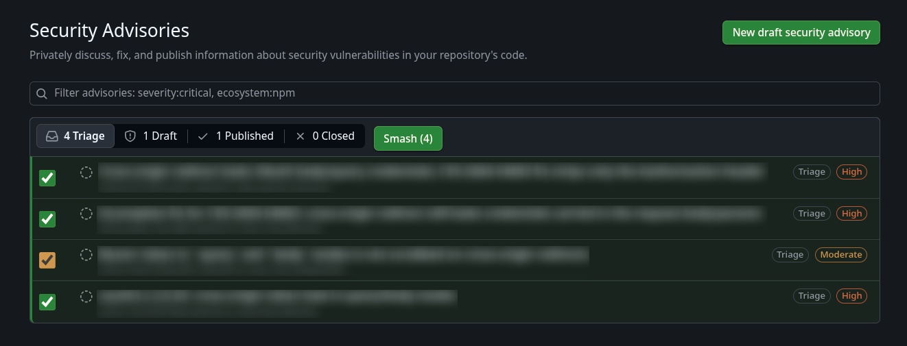
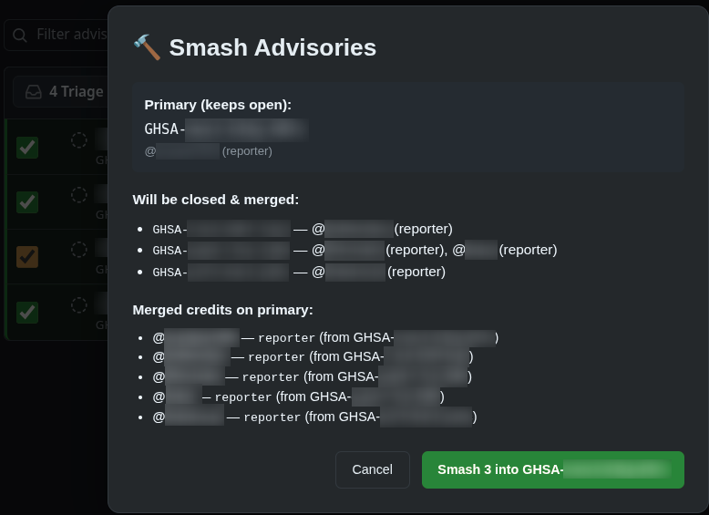

# GH Advisory Smash

Chrome extension to merge duplicate GitHub Security Advisories with credit roll-up.

## Screenshots

### Advisory List with Checkboxes



### Merge Confirmation Modal



## Install

### From Source (Development)

```bash
git clone https://github.com/pboling/gha-smash-chrome-plugin
cd gha-smash-chrome-plugin
```

1. Open `chrome://extensions`
2. Enable **Developer mode** (top-right toggle)
3. Click **Load unpacked**
4. Select the cloned folder

### From Chrome Web Store

_Not yet published_

## Setup: GitHub Personal Access Token (Required)

Before using the extension, you must configure a PAT with the correct permissions.

### Option 1: Classic PAT

1. Go to <https://github.com/settings/tokens>
2. Click **Generate new token (classic)**
3. Name it (e.g., "GH Advisory Smash")
4. Select **`repo`** scope (full repo access)
5. Generate and copy the token

### Option 2: Fine-Grained PAT (Recommended)

1. Go to <https://github.com/settings/personal-access-tokens/new>
2. Name it, set expiration, select target repository
3. **Repository permissions → Security advisories → Read and write**
4. Generate and copy the token

### Configure in Extension

1. Click the extension icon in your Chrome toolbar
2. Paste the token in the **GitHub API Token** field
3. Click **Save**

The extension stores the token in `chrome.storage.sync` (encrypted, synced across your browsers).

## Usage

1. Navigate to any repository's **Security Advisories** page:

   ```
   https://github.com/<owner>/<repo>/security/advisories
   ```

2. **Select state** using the tabs at the top:
   - **Triage** (default): `?state=triage` — ✅ **Supported**
   - **Draft**: `?state=draft` — ✅ **Supported**
   - **Closed**: `?state=closed` — ✅ **Supported**
   - **Published**: `?state=published` — ❌ **Disabled** (published advisories cannot be merged/closed via API)

3. **Checkboxes** appear next to each advisory row in the active state (hidden for Published)

4. **Select 2+ duplicate advisories** — the first selected becomes the **primary** (stays open, receives merged credits)

5. Click the **Smash (N)** button in the header (appears next to the segmented control; hidden for Published)

6. **Confirm modal** shows:
   - Primary advisory (kept open) with its current credits
   - Duplicate advisories to be closed with their credits
   - Merged credits that will be applied to the primary
   - Extension version (e.g., `v0.2.21`)

7. Click **Smash** to execute:
   - Primary advisory credits updated with combined credits from all selected
   - Duplicate advisories closed via GitHub API

### Cross-State Merging

The extension **only merges advisories within the same state** (triage, draft, or closed). To merge advisories across states:

1. Move the advisories into the same state first (via GitHub UI or API)
2. Refresh the page
3. Select and smash as normal

Selections are **persisted per state** — switching tabs preserves each state's selection independently. After a successful smash, the selection for that state is cleared.

**Note:** Published advisories are explicitly excluded — they cannot be merged or closed via the GitHub REST API. The plugin automatically disables itself on the Published tab.

## How It Works

### Architecture

| Component       | Role                                                                                   |
| --------------- | -------------------------------------------------------------------------------------- |
| `manifest.json` | Manifest V3 config, host permissions, content script registration                      |
| `background.js` | Service worker — executes GitHub API calls (avoids CORS), PAT authentication           |
| `content.js`    | Injected into advisory pages — UI injection, selection management, merge orchestration |
| `content.css`   | Styles for checkboxes, button, modal, row highlighting                                 |
| `popup.html/js` | Extension popup showing active status, PAT configuration, selection count              |

### Data Flow

```
User selects advisories
      ↓
content.js tracks selection in sessionStorage (per state)
      ↓
User clicks "Smash"
      ↓
content.js checks PAT availability (zero API calls if missing)
      ↓
content.js fetches advisory pages, parses credits from DOM
      ↓
content.js shows confirm modal with merged credits preview
      ↓
User confirms
      ↓
content.js sends UPDATE_ADVISORY_CREDITS + CLOSE_ADVISORY to background
      ↓
background.js calls GitHub REST API (PATCH /security-advisories/{ghsa_id})
      ↓
Page reloads to show updated state (selection cleared for that state)
```

### Credit Merging Logic

- Credits fetched from each advisory's page (DOM parsing)
- Credit types: `reporter`, `analyzer`, `remediation`, `other`
- **Priority**: remediation > analyzer > reporter > other
- Duplicate users deduplicated — highest priority type wins
- Merged credits applied to primary advisory via `PATCH /security-advisories/{ghsa_id}`

## Permissions

| Permission                                             | Purpose                                                                                |
| ------------------------------------------------------ | -------------------------------------------------------------------------------------- |
| `activeTab`                                            | Access current tab when popup opened                                                   |
| `scripting`                                            | Inject content script (redundant with manifest content_scripts, kept for flexibility)  |
| `storage`                                              | Store PAT in `chrome.storage.sync`                                                     |
| `https://github.com/*/security/advisories*`            | Content script match pattern; fetch advisory pages for credit parsing                  |
| `https://api.github.com/repos/*/security-advisories/*` | Background service worker calls GitHub REST API to update credits and close advisories |

## Security

Current PAT Storage:

Layer: User Input
Details: Popup (popup.html/js) — text input, saved via chrome.storage.sync.set({ github_pat: token })
────────────────────────────────────────
Layer: Storage
Details: chrome.storage.sync — encrypted at rest, synced across your Chrome profiles
────────────────────────────────────────
Layer: Background Access
Details: background.js reads via chrome.storage.sync.get(['github_pat']) with 30s in-memory cache
────────────────────────────────────────
Layer: Transmission
Details: Sent as Authorization: Bearer <pat> header to api.github.com (HTTPS only)

Safety Assessment:

Aspect: Encryption at rest
Status: ✅ Chrome encrypts storage.sync data
────────────────────────────────────────
Aspect: Sync scope
Status: ✅ Only your signed-in Chrome profiles (not sent to Google in plaintext)
────────────────────────────────────────
Aspect: In-memory exposure
Status: ⚠️ 30s cache in service worker memory — cleared on extension reload/browser restart
────────────────────────────────────────
Aspect: Console leakage
Status: ✅ PAT never logged (debug logs only show "found"/"none")
────────────────────────────────────────
Aspect: Network exposure
Status: ✅ Only sent to api.github.com over HTTPS with host_permissions
────────────────────────────────────────
Aspect: Extension compromise
Status: ⚠️ If extension code is malicious, it could exfiltrate — but code is open source, and you can read it. Please do report bugs!

## Development

### Project Structure

```
gha-smash-chrome-plugin/
├── manifest.json       # MV3 manifest
├── background.js       # Service worker (API calls, PAT auth)
├── content.js          # Content script (UI + logic)
├── content.css         # Styles
├── popup.html          # Popup UI
├── popup.js            # Popup logic
├── icons/              # 16/32/48/128px icons
├── assets/             # Screenshots for README
└── README.md           # This file
```

### Key Implementation Details

- **PAT Authentication**: Background service worker uses Bearer token auth (classic or fine-grained PAT)
- **State-Aware Selection**: Selection stored in `sessionStorage` per advisory state (`gha-smash-selected-{state}`)
- **MutationObserver**: Watches for paginated/filtered advisory list changes, re-injects UI
- **Tab Switch Detection**: Observes segmented control for state changes, auto-loads correct selection
- **GitHub DOM Selectors**: Targets current GitHub advisory list structure (`.Box-row`, segmented control, etc.)

### Testing Locally

1. Load unpacked extension (see Install)
2. Configure PAT in extension popup
3. Visit a repo with multiple security advisories (e.g., `github.com/owner/repo/security/advisories`)
4. Verify checkboxes appear, selection works, button enables at 2+
5. Open popup — should show "Active on this page" and selection count
6. Test both `?state=triage` and `?state=draft` tabs

## Debug Mode

Add `?ghsa-smash-debug=true` to the URL for verbose console logging:

```
https://github.com/owner/repo/security/advisories?state=triage&ghsa-smash-debug=true
```

## Limitations

- Requires **write access** to the repository (to update/close advisories via API)
- Relies on GitHub's current advisory page DOM structure — may break on UI changes
- Credit parsing uses heuristic selectors — may miss credits if GitHub changes markup
- No rate limit handling beyond browser's built-in fetch queue
- Single-repo only (no cross-repo advisory merging)
- Only merges advisories within the same state (triage/draft/published/closed)

## Contributing

1. Fork the repo
2. Create a feature branch
3. Make changes
4. Test locally with Load Unpacked
5. Submit PR

## License

MIT — see [MIT](MIT) for the license.
